# SSHやHTMLのポートをansibleやk3sで集約するやり方

## はじめに

  この資料は以下で構成されています

- SSH のポートを集約したい
- HTTPS のポートを集約したい
- ansible で構築したい
- k3s のさわりを知りたい

### SSH のポートを集約したい

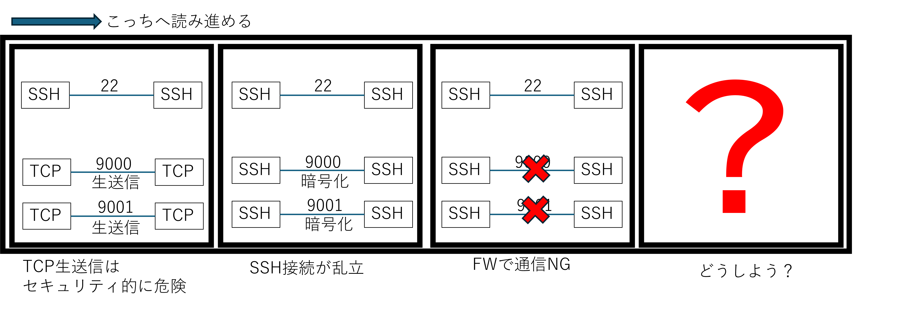

- 世の中は大セキュリティ時代です
- しかし telnet は平文です
- 平文の telnet は駆逐され、暗号化されたSSHが主流となりました
- そうして、SSHのサーバが乱立しました
- 複数のSSHサーバは多数の Layer4ポートを占有していきました
- しかし、セキュリティ的にはさらなる要求があります
- あろうことか、Layer4ポートを絞ろうという話がでてきたのです
- そうすると乱立したSSHが使いものになります
- いまもシステムは多数動いているというのに
- どうしよう？

### HTTPS のポートを集約したい


- 世の中は大セキュリティ時代です
- しかしHTTPは平文です
- 平文のHTTPは駆逐され、暗号化されたHTTPSが主流となりました
- そうして、HTTPSのサーバが乱立しました
- 複数のHTTPSサーバは多数の Layer4ポートを占有していきました
- しかし、セキュリティ的にはさらなる要求があります
- あろうことか、Layer4ポートを絞ろうという話がでてきたのです
- そうすると乱立したHTTPSが使いものになります
- いまもシステムは多数動いているというのに
- どうしよう？

### ansible で構築したい


- SSHやHTTPSの乱立を抑える必要があります
- 私はSSHやHTTPSのLayer4ポートを必ずや集約しなければならぬと決意しました
- しかし、多数のサーバに対して修正をあてるのはめんどくさいです
- そして私はめんどうなことが嫌いです
- 環境構築でめんどくさいとなったら、自動化すれば良いのです
- 全部 ansible で構築しようと考えました
- するとどうでしょう。他の記事とも差別化ができるようになったのです

### k3sのさわりを知りたい

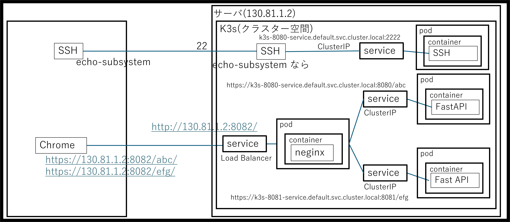

- 世の中は大 container 時代です
- サーバの環境を壊さないようために Dockerが流行しました
- しかし Docker には問題点があります
- Docker は単なる「コンテナを動かすツール」です
- 人類は「システム全体を自動で管理する仕組み」へのアップグレードしていかなければなりません
- そこで登場したのが k3s です
- k3sには以下のような特徴があります
    - 「死んだら自動で生き返る」自己修復機能
    - 「サービス名」で繋がる柔軟なネットワーク
    - 「ダウンタイムなし」のアップデート（ローリングアップデート）
    - 複数台のサーバーを1つのクラスター空間にまとめる（スケーラビリティ）
    - 「標準的なインフラ技術」の習得
- このk3sでの集約を行い外部からのアクセスを絞ることで、セキュリティはより堅牢になります

## 目次

- ということで、書くのは以下となります。

<!-- TOC -->
- [SSHやHTMLのポートをansibleやk3sで集約するやり方](#sshやhtmlのポートをansibleやk3sで集約するやり方)
    - [はじめに](#はじめに)
        - [SSH のポートを集約したい](#ssh-のポートを集約したい)
        - [HTTPS のポートを集約したい](#https-のポートを集約したい)
        - [ansible で構築したい](#ansible-で構築したい)
        - [k3sのさわりを知りたい](#k3sのさわりを知りたい)
    - [目次](#目次)
    - [【前提】おれおれ証明書を作る](#前提おれおれ証明書を作る)
        - [site.sh](#sitesh)
        - [all.yml](#allyml)
        - [hosts.yml](#hostsyml)
        - [site\_certificate.yml](#site_certificateyml)
    - [【前提】クライアントサーバモデルをpythonで作る(SSH)](#前提クライアントサーバモデルをpythonで作るssh)
        - [server.py](#serverpy)
        - [client.py](#clientpy)
        - [site\_update.yml](#site_updateyml)
    - [【前提】クライアントサーバモデルをpythonで作る(Subsystem)](#前提クライアントサーバモデルをpythonで作るsubsystem)
        - [server\_sub.py](#server_subpy)
        - [client\_sub.py](#client_subpy)
    - [SSH対応／ポートフォワード方式](#ssh対応ポートフォワード方式)
        - [ポートフォワード方式(SSHコマンド)](#ポートフォワード方式sshコマンド)
        - [SSH対応／ポートフォワード方式(.ssh/config)](#ssh対応ポートフォワード方式sshconfig)
        - [SSH対応／ポートフォワード方式(その他)](#ssh対応ポートフォワード方式その他)
    - [Subsystem方式(標準入出力)](#subsystem方式標準入出力)
        - [server\_sio.py](#server_siopy)
        - [site\_config\_sio.yml](#site_config_sioyml)
    - [SSH対応／Subsystem方式(TCP(ネットワーク))](#ssh対応subsystem方式tcpネットワーク)
        - [server\_tcp.py](#server_tcppy)
        - [site\_config\_tcp.yml](#site_config_tcpyml)
    - [SSH対応／ユーザ名方式](#ssh対応ユーザ名方式)
        - [site\_config\_user.yml](#site_config_useryml)
    - [【前提】サーバをPythonで作る(FastAPI)](#前提サーバをpythonで作るfastapi)
        - [server\_fast.py](#server_fastpy)
        - [site\_fast.yml](#site_fastyml)
    - [【前提】サーバをサービス化する](#前提サーバをサービス化する)
        - [site\_fast\_invoke\_start.yml](#site_fast_invoke_startyml)
        - [site\_service\_start.yml](#site_service_startyml)
        - [site\_fast\_invoke\_stop.yml](#site_fast_invoke_stopyml)
        - [site\_service\_stop.yml](#site_service_stopyml)
    - [HTTPS対応／リバースプロキシ(nginx)](#https対応リバースプロキシnginx)
        - [site\_nginx\_start.yml](#site_nginx_startyml)
        - [site\_nginx\_stop.yml](#site_nginx_stopyml)
    - [HTTPS対応／リバースプロキシ(ホスト名)](#https対応リバースプロキシホスト名)
    - [k3s 対応](#k3s-対応)
        - [【前提】k3sにすると何が良いのか？](#前提k3sにすると何が良いのか)
        - [k3s/dockerインストール](#k3sdockerインストール)
            - [site\_k3s\_install.yml](#site_k3s_installyml)
        - [podを作るための container の作成](#podを作るための-container-の作成)
            - [site\_k3s.yml (docker build)](#site_k3syml-docker-build)
            - [k3s-8080/Dockerfile または k3s-8081/Dockerfile](#k3s-8080dockerfile-または-k3s-8081dockerfile)
            - [k3s-8082/Dockerfile](#k3s-8082dockerfile)
            - [k3s-8082/reverse\_proxy.conf](#k3s-8082reverse_proxyconf)
        - [pod の適用](#pod-の適用)
            - [site\_k3s.yml (podの適用)](#site_k3syml-podの適用)
        - [coreDNS にノードからアクセスできるようにする](#coredns-にノードからアクセスできるようにする)
            - [site\_k3s.yml (coreDNS)](#site_k3syml-coredns)
        - [service の適用](#service-の適用)
            - [site\_k3s.yml (service)](#site_k3syml-service)
        - [SSHをSubsystemで振り分けて k3s の service に渡す](#sshをsubsystemで振り分けて-k3s-の-service-に渡す)
            - [site\_k3s.yml (subsystem)](#site_k3syml-subsystem)
    - [まとめ](#まとめ)
<!-- /TOC -->

## 【前提】おれおれ証明書を作る

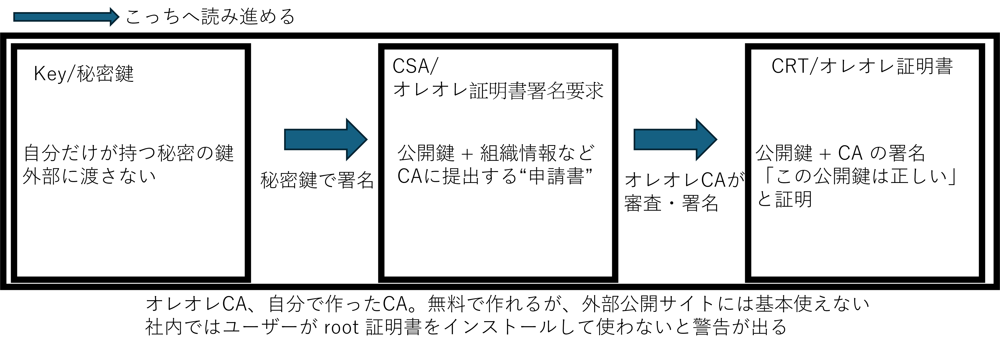

- まずは、証明書買うのがめんどうなので、SSH や HTTPS を通すためのおれおれ証明書を作成します
- 作成する構成は以下の通りです
    - /etc/ssl/private/server.key -- オレオレ秘密鍵 / Private Key
    - /etc/ssl/certs/server.csr -- オレオレ証明書署名要求 / Certificate Signing Request
    - /etc/ssl/certs/server.crt -- オレオレ証明書 / Certificate

- 公開するときは、オレオレ証明書ではなく本物を使う必要がありますが、今回は説明用なのでこれで進めます

- ansibleで証明書を作るときの構成は以下の通りです
    - ansible
        - group_vars
            - [all.yml](./ansible/group_vars/all.yml)
        - [hosts.yml](./ansible/hosts.yml)
        - [site_certificate.yml](./ansible/site_certificate.yml)
        - [site.sh](./ansible/site.sh)

- ここで、
    - サーバ側の IP を `130.81.1.2` ユーザを `t-ando` としました
    - group_vars/all.ymlには ansible-valutsで `vvv-password` を指定しています
    - このパスワードは `~/.vault_pass` にして非公開化しています

- 起動するには以下のようにします

```shell
ansible-playbook site_certificate.yml -i hosts.yml --vault-password-file ~/.vault_pass
```

### site.sh

- 前述のコマンドはいささか長すぎます。打つのが辛いです
- そこで、起動を簡単化するために [site.sh](./ansible/site.sh)を作りました

```shell
#!/bin/bash

if [ -z "$1" ]; then
    echo "usage: $0 site.yml"
    exit 1
fi

ansible-playbook $1 -i hosts.yml --vault-password-file ~/.vault_pass
```

- すると以下のように入力が楽になります

```shell
./site.sh site_certificate.yml
```

### all.yml

```yml
$ANSIBLE_VAULT;1.1;AES256
66356231393864353761633961353632613465346664643939363634316333393633386539376431
6566363764353861626662666361363732303362666530300a656465353233623366396130613039
64396563333631636365326238663264306362616465313839356566616566343936613634326163
6430613038356630300a646235333539633730323832626336303334653466333738306166326264
31613638636363313065303265323061653934633331306635356334386337393332
```

- [all.yml](./ansible/group_vars/all.yml) は ansible-vault で暗号化したテキストです
- ansible-vault を使うために `./ansible/group_vars/all.yml` にあらかじめ暗号化したいymlを用意しておきます

```yml
vvv_password: XXXXX
```

- そして以下のコマンドで暗号化します
- 暗号化するときに使ったパスワードは覚えておく必要があります

```shell
ansible-vault encrypt ./ansible/group_vars/all.yml
```

- 修正するときには以下のコマンドを投入します

```shell
ansible-vault edit ./ansible/group_vars/all.yml
```

- パスワードは `~/.vault_pass` などに置いて git などで公開しようにします
- ansible-playbook を起動するときに `--vault-password-file ~/.vault_pass` を引数にいれることで、ansible-vault のパスワードを読み込んで実行することが可能になります

### hosts.yml

- [hosts.yml](./ansible/hosts.yml) は、ホスト名を入れたインベントリです
- 今回サーバは 130.81.1.2 で t-ando がユーザ名なのでそれを記載します
- 書き方により複数同時に設定することも可能です

```yml
all:
  hosts:
    myhosts:
      ansible_host: 130.81.1.2
      ansible_user: t-ando
      ansible_password: "{{vvv_password}}"
      ansible_sudo_pass: "{{vvv_password}}"
```

### site_certificate.yml

- [site_certificate.yml](./ansible/site_certificate.yml) の中でオレオレ証明書を作成しています
- 具体手的には以下の個所です
    - まず作業用に `/etc/ssl/private/` フォルダを作成します
    - 次に server.key に暗号キーを作成します
    - server.key からは server.csr が生成できます
    - server.key と server.csr からは server.crt が生成できます
    - 最後に属性を変更して完了です

```yml
- hosts: myhosts
  tasks:
    - name: Create a directory
      file:
        path: /etc/ssl/private/
        state: directory
        mode: '0755'
      become: True
    - name: Create private key
      community.crypto.openssl_privatekey:
        path: /etc/ssl/private/server.key
        size: 2048
        type: RSA
      become: True
    - name: Create CSR
      community.crypto.openssl_csr:
        path: /etc/ssl/certs/server.csr
        privatekey_path: /etc/ssl/private/server.key
        common_name: "example.com"
        subject_alt_name: "DNS:example.com,DNS:://example.com"
      become: True
    - name: Create ORE-ORE certificate (10 year)
      community.crypto.x509_certificate:
        path: /etc/ssl/certs/server.crt
        privatekey_path: /etc/ssl/private/server.key
        csr_path: /etc/ssl/certs/server.csr
        provider: selfsigned
        selfsigned_not_after: "+3650d"
      become: True
    - name: chmod
      file:
        path: "{{item}}"
        mode: '0666'
        owner: root
        group: root
      loop:
        - /etc/ssl/private/server.key
        - /etc/ssl/certs/server.csr
      become: True
```

## 【前提】クライアントサーバモデルをpythonで作る(SSH)

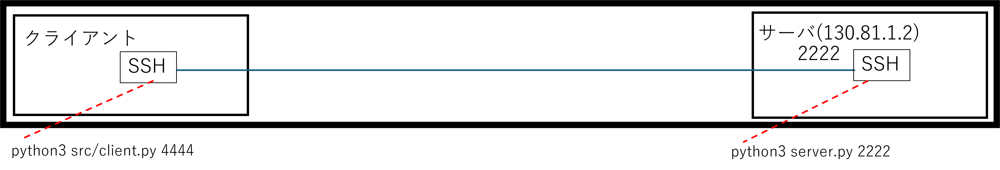

- SSHを集約する前に、サンプルとなるクライアント／サーバモデルを作ります
- 実装イメージは上記のような感じになります
    - 簡単なエコーサバ―です。
    - クライアントが サーバのIP `130.81.1.2`、 ポート `2222` にアクセスします

- クライアントとサーバの構成は以下の通りです
    - ansible
        - src
            - [server.py](./ansible/src/server.py)
            - [client.py](./ansible/src/client.py)
        - group_vars
            - [all.yml](./ansible/group_vars/all.yml)
        - [hosts.yml](./ansible/hosts.yml)
        - [site_update.yml](./ansible/site_update.yml)
        - [site.sh](./ansible/site.sh)

- `server*.py` のソースコードは以下のコマンドでリモートへ転送します

```shell
./site.sh site_update.yml
```

- リモートで以下を実行すると、サーバが起動します
    - 引数はLayer4ポート番号です

```shell
python3 server.py 2222
```

- ローカルのクライアント側で以下を実行し、表示がでることを確認しましょう

```shell
$ python3 src/client.py 130.81.1.2 2222 t-ando XXパスワードXX
Server response: Echo: Hello, Paramiko!
```

### server.py

- [server.py](./ansible/src/server.py) はSSHの簡単なエコーサーバです
    - サーバを起動し listen すると `handle_connection()` が呼ばれます
    - `handle_connection()` の中で受信したものを受け、そのまま返しています
    - SSHの実現には `paramiko` を使っています
    - ぶっちゃけサンプルなので、通信ができれば良いくらいの感覚であり、あまり実用的なコードではないです

```python
import socket
import paramiko
import threading
import sys


HOST_KEY = '/etc/ssl/private/server.key'


class EchoServerInterface(paramiko.ServerInterface):
    def check_auth_password(self, username, password):
        return paramiko.OPEN_SUCCEEDED

    def check_channel_request(self, kind, chanid):
        if kind == 'session':
            return paramiko.OPEN_SUCCEEDED
        return paramiko.OPEN_FAILED


def handle_connection(client_socket):
    transport = paramiko.Transport(client_socket)
    hostkey = paramiko.RSAKey(filename=HOST_KEY)
    transport.add_server_key(hostkey)
    server = EchoServerInterface()
    transport.start_server(server=server)
    chan = transport.accept()
    if chan is None:
        return
    print(f"Connected: {transport.getpeername()}")
    while True:
        data = chan.recv(1024)
        if not data:
            break
        print(f"Received: {data.decode()}")
        chan.send(b"Echo: " + data)
    chan.close()


def main(port):
    sock = socket.socket(socket.AF_INET, socket.SOCK_STREAM)
    sock.setsockopt(socket.SOL_SOCKET, socket.SO_REUSEADDR, 1)
    sock.bind(('0.0.0.0', port))
    sock.listen(100)
    print(f"Listening on port {port}...")
    while True:
        client, _ = sock.accept()
        threading.Thread(target=handle_connection, args=(client,)).start()


if __name__ == '__main__':
    main(int(sys.argv[1]))
```

### client.py

- [client.py](./ansible/src/client.py) はエコーサーバのクライアント実装です
    - サーバと同じく paramiko を使っています
    - SSHで接続して戻りを受けたら終了しています

```python
import paramiko
import sys


def main(ip, port, username, password):
    client = paramiko.SSHClient()
    client.set_missing_host_key_policy(paramiko.AutoAddPolicy())
    client.connect(ip, port=port, username=username, password=password)
    transport = client.get_transport()
    session = transport.open_session()
    message = "Hello, Paramiko!"
    session.send(message)
    received = session.recv(1024)
    print(f"Server response: {received.decode()}")
    session.close()
    client.close()


if __name__ == '__main__':
    main(sys.argv[1], sys.argv[2], sys.argv[3], sys.argv[4])
```

### site_update.yml

- [site_update.yml](./ansible/site_update.yml) の中で、ローカルからリモートへファイル転送をしています
- 具体手的には以下の通りです
    - まずサーバが動くように paramikoをインストールしています
    - カレントに `src` フォルダを作っています
    - ローカルフォルダの `src` 以下に `server*` のファイルを抽出しています
    - `server*` を検索形式にすることで、今後 `server*` のファイルが増えても対応できるようにしました
    - 最後に `copy` でリモートへファイル転送するようにしています

```yml
- hosts: myhosts
  tasks:
    - name: Install paramiko
      pip:
        name: paramiko
        state: present
    - name: Create a directory
      file:
        path: src
        state: directory
        mode: '0755'
    - find:
        paths: src
        patterns: "*server*"
        recurse: yes
      delegate_to: localhost
      register: found_files
    - name: update File
      copy:
        src: "{{item.path}}"
        dest: "{{item.path}}"
      loop: "{{ found_files.files }}"
```

## 【前提】クライアントサーバモデルをpythonで作る(Subsystem)

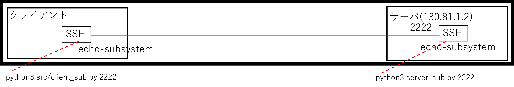

- SSHを集約する前に、SSHの Subsystem を用いたサンプルとなるクライアント／サーバモデルを作ります

- SSHの Subsystem（Subsystem） とは、SSH接続の通信路（セッション）を利用して、「特定の目的のために定義された別のプロトコルを実行する仕組み」 のことです
- 代表的には SFTP や NETCONF などがあります

- クライアントとサーバを作った構成は以下の通りです
    - ansible
        - src
            - [server_sub.py](./ansible/src/server_sub.py)
            - [client_sub.py](./ansible/src/client_sub.py)
        - group_vars
            - [all.yml](./ansible/group_vars/all.yml)
        - [hosts.yml](./ansible/hosts.yml)
        - [site_update.yml](./ansible/site_update.yml)
        - [site.sh](./ansible/site.sh)

- 作成したものの起動確認を行いましょう
- 以下のコマンドは、リモート側でポート `2222` にサーバを起動しています

```shell
python3 server_sub.py 2222
```

- ローカルのクライアント側で以下を実行し、表示がでることを確認しましょう

```shell
$ python3 src/client_sub.py 130.81.1.2 2222
Sent: Hello, Paramiko!
Received: Echo: Hello, Paramiko!
```

### server_sub.py

- [server_sub.py](./ansible/src/server_sub.py) はSSHのSubsystem を用いたエコーサーバです
    - SSHのSubsystem名は `echo-subsystem` としました
    - サーバを起動し listen すると `handle_connection()` が呼ばれます
    - `handle_connection()` の中で受信したものを受け、そのまま返しています
    - 単なるSSHとの差異は `transport` オブジェクトの `.set_subsystem_handler()` で "echo-subsystem" を設定して、"echo-subsystem" が来たら `EchoSubsystemHandler` に処理を委ねている点です
    - `EchoSubsystemHandler` が呼ばれると `_run()` の中でエコー処理をします

```python
import socket
import paramiko
import threading
import sys
import time

HOST_KEY = '/etc/ssl/private/server.key'


class EchoServerInterface(paramiko.ServerInterface):
    def check_auth_password(self, username, password):
        return paramiko.OPEN_SUCCEEDED

    def check_channel_request(self, kind, chanid):
        if kind == 'session':
            return paramiko.OPEN_SUCCEEDED
        return paramiko.OPEN_FAILED

    def check_subsystem_request(self, channel, name):
        print(f"check_subsystem_request name={name}")
        return False


class EchoSubsystemHandler(paramiko.server.SubsystemHandler):
    def __init__(self, channel, name, server):
        super().__init__(channel, name, server)
        print("EchoSubsystemHandler")
        self.channel = channel

    def _run(self):
        print("EchoSubsystemHandler _run")
        while True:
            # クライアントからのデータを受信
            data = self.channel.recv(1024)
            if not data or data.decode().strip() == "exit":
                break
            self.channel.sendall(f"Echo: {data.decode()}")
        self.channel.close()


def handle_connection(client_socket):
    transport = paramiko.Transport(client_socket)
    hostkey = paramiko.RSAKey(filename=HOST_KEY)
    transport.add_server_key(hostkey)
    server = EchoServerInterface()
    transport.start_server(server=server)
    chan = transport.accept()
    if chan is None:
        return
    print(f"Connected: {transport.getpeername()}")
    transport.set_subsystem_handler("echo-subsystem", EchoSubsystemHandler)
    try:
        while transport is not None and transport.is_active():
            time.sleep(1)
    finally:
        pass
    chan.close()


def main(port):
    sock = socket.socket(socket.AF_INET, socket.SOCK_STREAM)
    sock.setsockopt(socket.SOL_SOCKET, socket.SO_REUSEADDR, 1)
    sock.bind(('0.0.0.0', port))
    sock.listen(100)
    print(f"Listening on port {port}...")
    while True:
        client, _ = sock.accept()
        threading.Thread(target=handle_connection, args=(client,)).start()


if __name__ == '__main__':
    main(int(sys.argv[1]))
```

### client_sub.py

- [client_sub.py](./ansible/src/client_sub.py) はSSHのSubsystem版の実装です
    - SSHのSubsystem名は `echo-subsystem` としています
    - 単なるSSHとの違いは `channel.invoke_subsystem("echo-subsystem")` を呼んでいるところです

```python
import paramiko
import sys


def main(ip, port):
    client = paramiko.SSHClient()
    client.set_missing_host_key_policy(paramiko.AutoAddPolicy())
    client.connect(ip, port=port, username='t-ando', password='t-ando')
    transport = client.get_transport()
    channel = transport.open_session()
    channel.invoke_subsystem("echo-subsystem")
    message = "Hello, Paramiko!\r\n"
    channel.sendall(message)
    print(f"Sent: {message}")
    print(f"Received: {channel.recv(1024).decode()}")

    channel.close()
    client.close()


if __name__ == '__main__':
    main(sys.argv[1], sys.argv[2])
```

## SSH対応／ポートフォワード方式

- ポートフォワード方式には以下の２種類があります
    - SSHコマンド
    - .ssh/config

- 他にも tearterm などのツールを使う方法もありますが、省略します

### ポートフォワード方式(SSHコマンド)

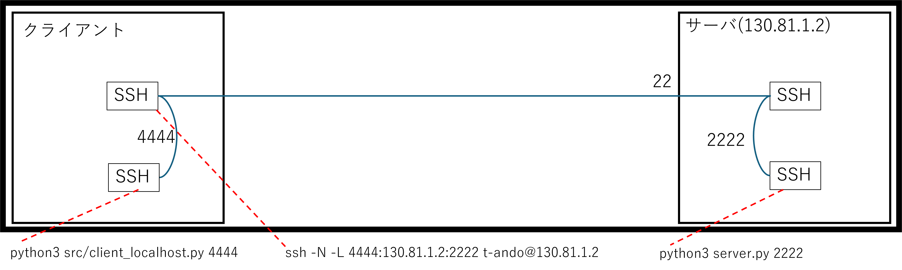

- ここからポートフォワーディングです
- クライアント側にポートフォワード用のコマンドを入れて、
  クライアントはそのポート経由でサーバにアクセスするようなイメージとなります。

- クライアントとサーバの構成は前述の通りです
    - ansible
        - src
            - [server.py](./ansible/src/server.py)
            - [client.py](./ansible/src/client.py)
        - group_vars
            - [all.yml](./ansible/group_vars/all.yml)
        - [hosts.yml](./ansible/hosts.yml)
        - [site_update.yml](./ansible/site_update.yml)
        - [site.sh](./ansible/site.sh)

- リモートで以下を実行すると、サーバが起動します
    - 引数はLayer4ポート番号です

```shell
python3 server.py 2222
```

- ローカルで以下を実行し、ポートフォワードを実現します
- 起動しっぱなしで Ctrl-C などで停止しないでください。
- 停止した場合ポートフォワードが終了します
- これによりローカルの Layer4 ポート 4444 はリモートの22ポートを通って2222ポートに転送されます

```shell
ssh -N -L 4444:130.81.1.2:2222 t-ando@130.81.1.2
```

- クライアント側はローカルホスト `localhost` のポート `4444` を指定して起動することになります
- 直接実行するものと同じ結果が得られていることが確認できます

```shell
$ python3 src/client.py localhost 4444 t-ando XXパスワードXX
Server response: Echo: Hello, Paramiko!
```

### SSH対応／ポートフォワード方式(.ssh/config)


- ここからポートフォワーディングです
- クライアント側にポートフォワード用の設定を `.ssh/config` に入れてコマンドを起動し、
  クライアントはそのポート経由でサーバにアクセスするようなイメージとなります。

- UNIX系の場合は `~/ssh/config` は以下になります
    - Windowsの場合は `C:\Users\%USERNAME%\.ssh\config` です
    - wslの場合はパーミッションを厳格にする必要があります
        - `chmod 700 ~/.ssh`
        - `chmod 600 ~/.ssh/config`

```shell
# ssh -N -L 4444:130.81.1.2:2222 t-ando@130.81.1.2 相当
Host my-tunnel
    HostName 130.81.1.2
    User t-ando
    # ローカルポートフォワード設定 [-L 4444:130.81.1.2:2222]
    LocalForward 4444 130.81.1.2:2222
    # シェルを起動しない設定 [-N]
    SessionType none
```

- 上記設定後、以下のコマンドを打ちます
    - `ssh` 後の名称は `.ssh/config` で指定したものと同じです
    - 終了するためには `Ctrl-C` で停止させます

```shell
ssh my-tunnel
```

- `ssh my-tunnel` でポートフォワードしますので、以下のコマンドで通信ができます

```shell
$ python3 src/client.py 130.81.1.2 2222 t-ando t-ando
Server response: Echo: Hello, Paramiko!
```

### SSH対応／ポートフォワード方式(その他)

- その他の方式としては teraterm などのツールを使ったポートフォワードがありますが、ツール系を紹介しだすと終わらないのでここでは省略します

## Subsystem方式(標準入出力)

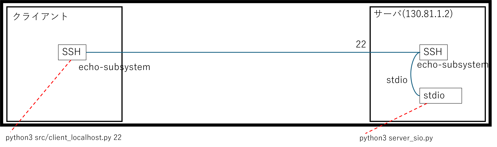

- Subsystemとは SSHサーバーが「特定の機能を外部コマンドとして提供する仕組み」で、代表例は SFTP（SSH File Transfer Protocol）や NETCONF です。
- Subsystemはさらに受信側をどうやって動かすかによって実装が変わっていきます
    - 標準入出力方式
    - TCP(ネットワーク)

- Subsystem 方式の標準入出力方式は、クライアント側はサブシステムに接続するのは変わりませんが、SSH側は振り分けで標準入力および標準出力を使用するところが異なります。
    - `server_sio.py` では入力を標準入力(stdin)で受け、標準出力(stdout)に出力します
    - `client_sub.py` は `echo-subsystem` にデータを流すのは変わりませんが、ポート番号を `22` に変えています。
    - そして `/etc/ssh/sshd_config` に `subsystem` を追加します。

- 標準入出力方式によるSubsystem方式の構成は以下の通りです
    - ansible
        - src
            - [server_sio.py](./ansible/src/server_sio.py)
            - [client_sub.py](./ansible/src/client_sub.py)
        - group_vars
            - [all.yml](./ansible/group_vars/all.yml)
        - [hosts.yml](./ansible/hosts.yml)
        - [site_config_sio.yml](./ansible/site_config_sio.yml)
        - [site_update.yml](./ansible/site_update.yml)
        - [site.sh](./ansible/site.sh)

- リモートにファイルを [site_update.yml](./ansible/site_update.yml) でアップデートして更新します
- [site_config_sio.yml](./ansible/site_config_sio.yml) で `/etc/ssh/sshd_config` を更新します

```shell
./site.sh site_update.yml
./site.sh site_config_sio.yml
```

- リモートのサーバを起動しておきます
- この場合標準入出力に生情報が送られるので `sys` で実装します

```shell
python3 server_sio.py
```

- クライアント側はポート `22` を指定して起動することになります

```shell
$ python3 src/client_sub.py 130.81.1.2 22
Sent: Hello, Paramiko!

Received: Echo: Hello, Paramiko!
```

### server_sio.py

- [server_sio.py](./ansible/src/server_sio.py) はSSHのSubsystem から展開されるエコーサーバです
    - 標準入出力の受送信には `sys.stdin` および `sys.stdoit` を使います
    - 標準入出力は使い方に癖があり、書き出しのフラッシュに `sys.stdout.flush()` が必要になるなど注意が必要です
    - また、Subsystem が呼ばれるたびに起動されるので、あまり重い処理の場合、初期起動の時間は気になるところです

```python
import sys

def main():
    for line in sys.stdin:
        input_data = line.strip()
        
        # 独自のロジックを実行
        response = f"Echo: {input_data}\n"
        
        # 結果を標準出力に書き出す
        sys.stdout.write(response)
        # flushがないと永続待ちになる
        sys.stdout.flush()
        # １行処理したら強制切断する
        break

if __name__ == "__main__":
    main()
```

### site_config_sio.yml

- [site_config_sio.yml](./ansible/site_config_sio.yml) はSSH対応／Subsystem方式(標準入出力)を実現するための ansible-playbook です

- SSHでSubsystem振り分けをするための `/etc/ssh/sshd_config` の書き方は以下の通りです
- `python3 /home/t-ando/src/server_sio.py` を直接起動して標準入出力を渡しています

```text
Subsystem echo-subsystem python3 /home/t-ando/src/server_sio.py
```

- これを ansible で実装するには `lineinfile` を使用します。
    - `notify` は変化があったときに起動させるものです
    - 変化があると `handlers` が起動されます

```yml
- hosts: myhosts
  tasks:
    - name: Ensure subsystem is configured
      lineinfile:
        path: /etc/ssh/sshd_config
        regexp: '^Subsystem\s+echo-subsystem'
        line: 'Subsystem echo-subsystem python3 {{ansible_env.PWD}}/src/server_sio.py'
        state: present
      notify: Restart sshd
      become: True

  handlers:
    - name: Restart sshd
      service:
        name: sshd
        state: restarted
      become: True
```

## SSH対応／Subsystem方式(TCP(ネットワーク))


- Subsystemとは SSHサーバーが「特定の機能を外部コマンドとして提供する仕組み」で、代表例は SFTP（SSH File Transfer Protocol）や NETCONF です。
- Subsystemはさらに受信側をどうやって動かすかによって実装が変わっていきます
    - 標準入出力方式
    - TCP(ネットワーク)

- Subsystem 方式の標準入出力方式は、クライアント側はサブシステムに接続するのは変わりませんが、SSH側は振り分けでsocketに転送するところが異なります。
    - `server_sio.py` では入出力をsocket (TCP) で行います
    - `client_sub.py` は `echo-subsystem` にデータを流すのは変わりませんが、ポート番号を `22` に変えています。
    - そして `/etc/ssh/sshd_config` に `subsystem` を追加します。

- TCP方式によるSubsystem方式の構成は以下の通りです
    - ansible
        - src
            - [server_tcp.py](./ansible/src/server_tcp.py)
            - [client_sub.py](./ansible/src/client_sub.py)
        - group_vars
            - [all.yml](./ansible/group_vars/all.yml)
        - [hosts.yml](./ansible/hosts.yml)
        - [site_config_tcp.yml](./ansible/site_config_tcp.yml)
        - [site_update.yml](./ansible/site_update.yml)
        - [site.sh](./ansible/site.sh)

- リモートにファイルを [site_update.yml](./ansible/site_update.yml) でアップデートして更新します
- [site_config_tcp.yml](./ansible/site_config_tcp.yml) で `/etc/ssh/sshd_config` を更新します

```shell
./site.sh site_update.yml
./site.sh site_config_tcp.yml
```

- リモートのサーバを起動しておきます
- この場合 `/usr/bin/nc` コマンドで生情報が送られるので、普通に `socket` で実装します

```shell
python3 server_tcp.py 2222
```

- クライアント側はポート `22` を指定して起動することになります

```shell
$ python3 src/client_sub.py 130.81.1.2 22
Sent: Hello, Paramiko!

Received: Echo: Hello, Paramiko!
```

### server_tcp.py

- [server_tcp.py](./ansible/src/server_tcp.py) はSSHのSubsystem から展開されるエコーサーバです
    - TCPの受送信には `socket` を使用します
    - サーバとして別に立ち上げておく必要があるので service 化するなど永続化を別にする必要があります

```python
import socket
import sys


def main(port):
    with socket.socket(socket.AF_INET, socket.SOCK_STREAM) as s:
        s.bind(('0.0.0.0', port))
        s.listen()
        while True:
            print(f'Server listening on {port}')
            try:
                conn, addr = s.accept()
                with conn:
                    print(f'Connected by {addr}')
                    data = conn.recv(1024)
                    if data:
                        result = f"Echo: {data.decode()}\n"
                        conn.sendall(result.encode())
            finally:
                pass


if __name__ == '__main__':
    main(int(sys.argv[1]))
```

### site_config_tcp.yml

- [site_config_tcp.yml](./ansible/site_config_tcp.yml) はSSH対応／Subsystem方式(TCP)を実現するための ansible-playbook です

- SSHでSubsystem振り分けをするための `/etc/ssh/sshd_config` の書き方は以下の通りです
- `/usr/bin/nc` を使って転送を行っています

```text
Subsystem echo-subsystem /usr/bin/nc localhost 2222
```

- これを ansible で実装するには `lineinfile` を使用します。
    - `notify` は変化があったときに起動させるものです
    - 変化があると `handlers` が起動されます

```yml
- hosts: myhosts
  tasks:
    - name: Ensure subsystem is configured
      lineinfile:
        path: /etc/ssh/sshd_config
        regexp: '^Subsystem\s+echo-subsystem'
        line: 'Subsystem echo-subsystem /usr/bin/nc localhost 2222'
        state: present
      notify: Restart sshd
      become: True

  handlers:
    - name: Restart sshd
      service:
        name: sshd
        state: restarted
      become: True
```

## SSH対応／ユーザ名方式

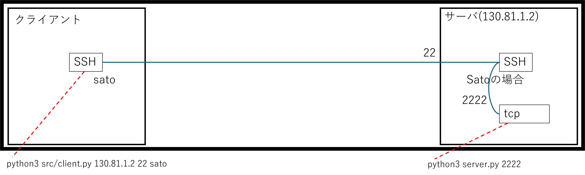

- 今までの例では `/etc/ssh/sshd_config` ではSubsystemで振り分けを行いましたが、ユーザ名での振り分けを行うことも可能です

- そこで問題となるのが ansibleでの書き方です
    - いままでは１行で収まっていましたが、今回２行あります
    - このような場合は、`Match User sato` が存在するか確認し、
      存在しない場合はこの２行を加えるといった記述を行います

- ユーザー名方式によるSubsystem方式の構成は以下の通りです
    - ansible
        - src
            - [server_tcp.py](./ansible/src/server_tcp.py)
        - group_vars
            - [all.yml](./ansible/group_vars/all.yml)
        - [hosts.yml](./ansible/hosts.yml)
        - [site_config_user.yml](./ansible/site_config_user.yml)
        - [site_update.yml](./ansible/site_update.yml)
        - [site.sh](./ansible/site.sh)

- リモートにファイルを [site_update.yml](./ansible/site_update.yml) でアップデートして更新します
- [site_config_user.yml](./ansible/site_config_user.yml) で `/etc/ssh/sshd_config` を更新します

```shell
./site.sh site_update.yml
./site.sh site_config_user.yml
```

- リモートのサーバを起動しておきます
- この場合 `/usr/bin/nc` コマンドで生情報が送られるので、普通に `socket` で実装します

```shell
python3 server_tcp.py 2222
```

- シェルを実行すると結果が返ってくるのを確認できます

```shell
$ ssh sato@130.81.1.2
sato@130.81.1.2's password:
aaa
Echo: aaa

exit
Connection to 130.81.1.2 closed.
```

### site_config_user.yml

- [site_config_user.yml](./ansible/site_config_user.yml) はSSH対応／ユーザー方式を実現するための ansible-playbook です

- まず ansibleで `sato` ユーザを作ります
- passlib はローカル側にないとパスワードが作れませんでした

- `/etc/ssh/sshd_config` の書き方はこのようになります
    - この例では `sato` ユーザが対象になります
    - すでに起動済の `localhost` の `2222` ポートへ接続を飛ばします

```text
Match User sato  # TARGET1
    ForceCommand /usr/bin/nc localhost 2222  # TARGET2
```

```yaml
    - name: Install pip
      pip:
        name: passlib
        state: present
      # ローカルにpasslibを入れてユーザ生成できるようにする
      delegate_to: localhost

    - name: satoユーザーを作成する
      ansible.builtin.user:
        name: "{{user_name}}"
        shell: /bin/bash
        create_home: yes
        password: "{{ user_name | password_hash('sha512') }}"
        state: present
      become: True
```

- さらに ansibleでblockinfileを指定することで、ファイルの最後にテキストを追加します

```yaml
    - name: satoユーザーは2222を呼び出す
      ansible.builtin.blockinfile:
        path: /etc/ssh/sshd_config
        block: |
          Match User sato
              ForceCommand /usr/bin/nc localhost 2222
      notify: Restart sshd
      become: True

  handlers:
    - name: Restart sshd
      service:
        name: sshd
        state: restarted
      become: True
```

- /etc/ssh/sshd_config を除くと、最後に以下の行が追加されているが確認できます
- BEGINからENDのブロックの中身が `block` で差し変わります

```text
# BEGIN ANSIBLE MANAGED BLOCK
Match User sato
    ForceCommand /usr/bin/nc localhost 2222
# END ANSIBLE MANAGED BLOCK
```

## 【前提】サーバをPythonで作る(FastAPI)

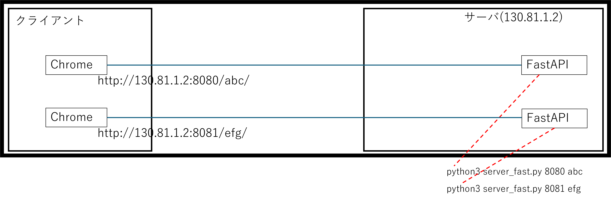

- HTTPS対応をする前にフロントとなる HTTPサーバをFastAPIで作っていきます
- 作ったものは Chromeで呼び出せます
- 構成は以下の通りです
    - ansible
        - src
            - [server_fast.py](./ansible/src/server_fast.py)
        - group_vars
            - [all.yml](./ansible/group_vars/all.yml)
        - [hosts.yml](./ansible/hosts.yml)
        - [site_update.yml](./ansible/site_update.yml)
        - [site_fast.yml](./ansible/site_fast.yml)
        - [site.sh](./ansible/site.sh)

- FastAPI を動かすために pip インストールがいるので site_fast.ymlを用意しました
- これを実施します

```shell
./site.sh site_update.yml
```

- リモートのサーバを起動しておきます(その１)
    - ここから `http://130.81.1.2:8080/abc/` にアクセスすると `Hello world (abc)` を表示されます

```shell
python3 src/server_fast.py 8080 abc
```

- リモートのサーバを起動しておきます(その2)
    - ここから `http://130.81.1.2:8081/efg/` にアクセスすると `Hello world (efg)` を表示されます

```shell
python3 src/server_fast.py 8080 abc
```

### server_fast.py

- [server_fast.py](./ansible/src/server_fast.py) は FastAPI を使って HTTPサーバを実現します
- FastAPIとは、一言でいうと「Pythonで爆速かつモダンなAPIを作るためのWebフレームワーク」です
- 簡単にWebサーバを実現できるので、例として用意しました
- pip として fastapi と uvicorn が必要です

```python
import sys
import uvicorn
from fastapi import FastAPI

app = FastAPI()

@app.get(f"/{sys.argv[2]}")
def read_root():
    return f"Hello World ({sys.argv[2]})"

def main(port):
    uvicorn.run("server_fast:app", host="0.0.0.0", port=port, reload=True)

if __name__ == '__main__':
    main(int(sys.argv[1]))
```

### site_fast.yml

- [site_fast.yml](./ansible/site_fast.yml) は FastAPI を使うために pip を実行して、ファイルを更新するための ansible -playbookです
- [site_update.yml](./ansible/site_update.yml) を `import_playbook` で呼んでいるので、一回の起動でまとめて実行できます

```yml
- hosts: myhosts
  tasks:
    - name: Install paramiko
      pip:
        name: "{{item}}"
        state: present
      loop:
        - fastapi
        - uvicorn

- name: ソフトのアップデート
  import_playbook: site_update.yml
```

## 【前提】サーバをサービス化する

- このように複数のHTTPを立ち上げるとターミナルを消費するので、
  バックグラウンドで動かせるようにサービス化します
- 構成は以下の通りです
    - ansible
        - src
            - [server_fast.py](./ansible/src/server_fast.py)
        - group_vars
            - [all.yml](./ansible/group_vars/all.yml)
        - [hosts.yml](./ansible/hosts.yml)
        - [site_update.yml](./ansible/site_update.yml)
        - [site_fast.yml](./ansible/site_fast.yml)
        - [site_fast_invoke_start.yml](./ansible/site_fast_invoke_start.yml)
        - [site_service_start.yml](./ansible/site_service_start.yml)
        - [site_fast_invoke_stop.yml](./ansible/site_fast_invoke_stop.yml)
        - [site_service_stop.yml](./ansible/site_service_stop.yml)
        - [site.sh](./ansible/site.sh)

- 起動する場合は [site_fast_invoke_start.yml](./ansible/site_fast_invoke_start.yml) で [site_service_start.yml](./ansible/site_service_start.yml) を呼び出します
- 変数によって 8080 ポートと 8081 ポートを同時に *サービス化* できます
- 以下を実行することで、リモートのサーバを再起動しても起動するようになります

```shell
./site.sh site_fast_invoke_start.yml
```

- サービスの開始ができるようになったら、デバッグ用に停止も用意しましょう
- 停止する場合は [site_fast_invoke_stop.yml](./ansible/site_fast_invoke_stop.yml) で site_service_stop.yml を呼び出します
- 変数によって 起動したサービスを *停止* します
- 以下を実行することで、リモートのサーバを再起動しても停止したままになります

```shell
./site.sh site_fast_invoke_stop.yml
```

- Chromeで実施すると以下が得られます

- `http://130.81.1.2:8080/abc/` の起動結果は以下の通りです


- `http://130.81.1.2:8081/efg/` の起動結果は以下の通りです


### site_fast_invoke_start.yml

- [site_fast_invoke_start.yml](./ansible/site_fast_invoke_start.yml) はパラメータを変更しながら [site_service_start.yml](./ansible/site_service_start.yml) を連続して呼び出す ansible-playook です
- `loop_control` を使うことでループするときの変数を `item` から `tasks_item` に替えられます

```yml
- name: ソフトのアップデート
  import_playbook: site_fast.yml

- hosts: myhosts
  tasks:
    - name: サービスをループで実行する
      ansible.builtin.include_tasks: site_service_start.yml
      loop:
        - service_name: "fastapi8080"
          user_name: "{{ansible_env.USER}}"
          base_dir: "{{ansible_env.PWD}}/src"
          invoker: "python3 server_fast.py 8080 abc"
        - service_name: "fastapi8081"
          user_name: "{{ansible_env.USER}}"
          base_dir: "{{ansible_env.PWD}}/src"
          invoker: "python3 server_fast.py 8081 efg"
      loop_control:
        loop_var: tasks_item
```

### site_service_start.yml

- [site_service_start.yml](./ansible/site_service_start.yml) は１つのサービス化を行うansible-playbookです
- まず "/etc/systemd/system/{{ tasks_item.service_name }}.service" ファイルを作成します
- このファイルをつかって systemd でサービスを restarted して起動しなおします

```yml
- name: systemdユニットファイルの作成(永続化設定)
  ansible.builtin.copy:
    content: |
      [Unit]
      Description=Service for {{ tasks_item.user_name }}
      After=network.target

      [Service]
      User={{ tasks_item.user_name }}
      Group={{ tasks_item.user_name }}
      WorkingDirectory={{ tasks_item.base_dir }}
      #
      ExecStart={{ tasks_item.invoker }}
      Restart=always

      [Install]
      WantedBy=multi-user.target
    dest: "/etc/systemd/system/{{ tasks_item.service_name }}.service"
  become: True

- name: サービスの有効化と起動
  ansible.builtin.systemd:
    name: "{{ tasks_item.service_name }}"
    state: restarted
    enabled: yes
    daemon_reload: yes
  become: True

- name: サービスが正常に動いているか確認
  ansible.builtin.command: systemctl status {{ tasks_item.service_name }}
  register: service_status
  changed_when: False
  ignore_errors: True
  become: True

- name: ステータスを表示
  ansible.builtin.debug:
    var: service_status.stdout_lines
```

### site_fast_invoke_stop.yml

- [site_fast_invoke_stop.yml](./ansible/site_fast_invoke_stop.yml) はパラメータを変更しながら [site_service_stop.yml](./ansible/site_service_stop.yml) を連続して呼び出す ansible-playook です
- `loop_control` を使うことでループするときの変数を `item` から `tasks_item` に替えられます

```yml
- hosts: myhosts
  tasks:
    - name: サービスをループで実行する
      ansible.builtin.include_tasks: site_service_stop.yml
      loop:
        - service_name: "fastapi8080"
        - service_name: "fastapi8081"
      loop_control:
        loop_var: tasks_item
```

### site_service_stop.yml

- [site_service_stop.yml](./ansible/site_service_stop.yml) は１つのサービスを停止するansible-playbookです

```yml
- name: サービスの有効化と起動
  ansible.builtin.systemd:
    name: "{{ tasks_item.service_name }}"
    state: stopped
    enabled: yes
    daemon_reload: yes
  ignore_errors: True
  become: True

- name: サービスが正常に停止しているか確認
  ansible.builtin.command: systemctl status {{ tasks_item.service_name }}
  register: service_status
  changed_when: False
  ignore_errors: True
  become: True

- name: ステータスを表示
  ansible.builtin.debug:
    var: service_status.stdout_lines
```

## HTTPS対応／リバースプロキシ(nginx)

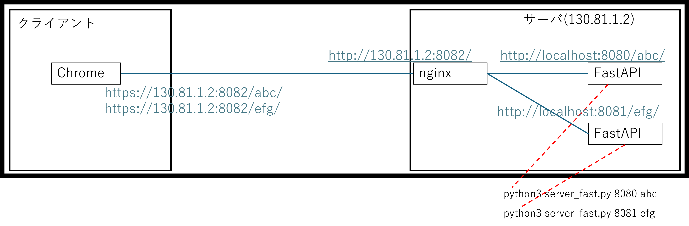

- nginx（エンジンエックス）とは、世界中で最も使われている「超高性能なWebサーバー兼Webリバースプロキシ」ソフトウェアです。
- Webリバースプロキシとは、一言でいうと「外部からのアクセスを一度すべて受け止め、適切なサーバーへ受け渡す『受付カウンター』」のような仕組みのことです。

- Webリバースプロキシの構成は以下の通りです
    - ansible
        - group_vars
            - [all.yml](./ansible/group_vars/all.yml)
        - [hosts.yml](./ansible/hosts.yml)
        - [site_fast_invoke_start.yml](./ansible/site_fast_invoke_start.yml)
        - [site_service_start.yml](./ansible/site_service_start.yml)
        - [site_nginx_start.yml](./ansible/site_nginx_start.yml)
        - [site_nginx_stop.yml](./ansible/site_nginx_stop.yml)
        - [site_service_stop.yml](./ansible/site_service_stop.yml)
        - [site.sh](./ansible/site.sh)

- 以下を実行することで、nginx のサービスが起動します
    - 内部でリバースプロキシを実行します

```shell
./site.sh site_nginx_start.yml
```

- 以下を実行することで、nginx のサービスが停止します

```shell
./site.sh site_nginx_stop.yml
```

- `https://130.81.1.2:8082/abs` を呼び出した結果は以下の通りです
    - `https://130.81.1.2:8082/abs` が `http://130.81.1.2:8080/abs` に内部で変換されます
    - オレオレ証明書なので「保護されていない通信」というメッセージがでます
    - 商用で使うときは本物の証明書を使ってください


- `https://130.81.1.2:8082/efg` を呼び出した結果は以下の通りです
    - `https://130.81.1.2:8082/efg` が `http://130.81.1.2:8081/efg` に内部で変換されます
    - オレオレ証明書なので「保護されていない通信」というメッセージがでます
    - 商用で使うときは本物の証明書を使ってください


### site_nginx_start.yml

- [site_nginx_start.yml](./ansible/site_nginx_start.yml) は nginx を起動するための ansible-playbookです

- nginx を起動するときに、バックグラウンドで動くものがないと厳しいので、`import_playbook` を使って [site_fast_invoke_start.yml](./ansible/site_fast_invoke_start.yml) の ansible-playbook を起動します

```yml
- name: バックグラウンドのサービスを起動
  import_playbook: site_fast_invoke_start.yml
```

- 次に nginx を起動するために以下の記述を `/etc/nginx/conf.d/reverse_proxy.conf` に追加します
    - listen に ssl を指定することでHTTPSを指定します
    - ssl_certificate で crt を指定します
    - ssl_certificate_key で key を指定します
    - これで、証明書がここだけで済むというのが大きな利点となります

```yml
    - name: リバースプロキシの設定ファイルを配置
      ansible.builtin.copy:
        dest: /etc/nginx/conf.d/reverse_proxy.conf
        content: |
          server {
              listen 8082 ssl;
              server_name {{ server_hostname }};
              # 証明書と秘密鍵のパスを指定
              ssl_certificate /etc/ssl/certs/server.crt;
              ssl_certificate_key /etc/ssl/private/server.key;
              location /abc {
                  proxy_pass http://localhost:8080/abc;
                  proxy_set_header Host $host;
                  proxy_set_header X-Real-IP $remote_addr;
              }
              location /efg {
                  proxy_pass http://localhost:8081/efg;
                  proxy_set_header Host $host;
                  proxy_set_header X-Real-IP $remote_addr;
              }
          }
        mode: '0644'
      notify: Reload Nginx
      become: True
```

- それからデフォルトで動いている以下を削除します

```shell
    - name: デフォルト設定を削除
      ansible.builtin.file:
        path: "{{ item }}"
        state: absent
      loop:
        - /etc/nginx/sites-enabled/default
        - /etc/nginx/sites-available/default
      notify: Reload Nginx
      become: True
```

- 最後に systemd の started で起動していない場合に起動します
- 変更があった場合は handlers の systemd による reloaded で強制再起動します

```yml
    - name: Nginxを起動・有効化
      ansible.builtin.systemd:
        name: nginx
        state: started # handlersはreloadなのに注意
        enabled: true
      become: True

  handlers:
    - name: Reload Nginx
      ansible.builtin.systemd:
        name: nginx
        state: reloaded
      become: True
```

### site_nginx_stop.yml

- [site_nginx_stop.yml](./ansible/site_nginx_stop.yml) はサービスをまとめて停止する ansible-playbookです
- とはいえやっていることは サービス名を指定して繰り返し [site_service_stop.yml](./ansible/site_service_stop.yml) を呼んでいるだけです

```yml
- hosts: myhosts
  tasks:
    - name: サービスをループで実行する
      ansible.builtin.include_tasks: site_service_stop.yml
      loop:
        - service_name: "fastapi8080"
        - service_name: "fastapi8081"
        - service_name: "nginx"
      loop_control:
        loop_var: tasks_item
```

## HTTPS対応／リバースプロキシ(ホスト名)

- nginx を起動するために以下の記述を `/etc/nginx/conf.d/reverse_proxy.conf` に追加します
    - ホスト名が変わるので証明書が別に必要になります
    - DNS や /etc/hosts の設定を変える必要があります
    - これで何が楽しいか分からないので実際のコードは省略します

```text
# app1 用の設定
server {
    listen 80 ssl;
    server_name ://AAA.com;
    ssl_certificate /etc/ssl/certs/server1.crt;
    ssl_certificate_key /etc/ssl/private/server1.key;
    location / {
        proxy_pass http://localhost:8080/abc;
        proxy_set_header Host $host;
        proxy_set_header X-Real-IP $remote_addr;
    }
}

# app2 用の設定（別のアプリへプロキシする場合）
server {
    listen 80;
    server_name ://BBB.com;
    ssl_certificate /etc/ssl/certs/server2.crt;
    ssl_certificate_key /etc/ssl/private/server2.key;
    location / {
        proxy_pass http://localhost:8081/efg;
        proxy_set_header Host $host;
        proxy_set_header X-Real-IP $remote_addr;
    }
}
```

## k3s 対応


- いままではサービスで処理をしていましたが、より流動的に実装しようとした場合、Kubernetes 化はかかせません
- しかし Kubernetes (通称 k8s) は非常に思い実装になるため、 まずは k3s で実装を考えましょう
- k3s とは簡単に言うとめちゃくちゃ軽くて、設置が簡単なKubernetes です
- 一つの contatier を処理量によってスケーラビリティを取ったり、故障時に別のサーバに移動したりといったことが非常に簡単になります
- k3s は大きく分けると以下に分かれます
    - container
    - pod
    - service
- containerは動作させる最小単位です。主にDockerでビルドして作ります
- pod は k3sで処理を動かすための最小単位です
- service は外部や内部からアクセスするための入り口になります
- イメージとしては以下のようになります


- 外部からのアクセスを受けて、内部の処理をさせるには k3s の coreDNSというものから、k3sのサービスのホスト名から内部のIPに変換することで、pod間の通信ができるようになります

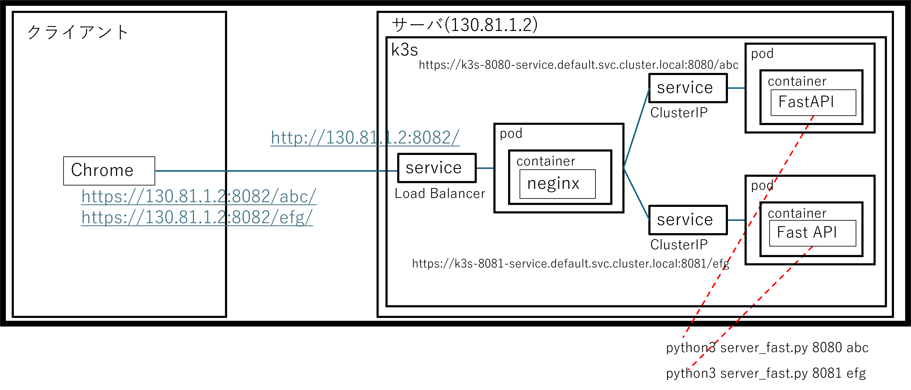

- 上記の図では、中央のneginx のコンテナは coreDNS を通じて `k3s-8080-service.default.svc.cluster.local` や `k3s-8081-service.default.svc.cluster.local` といったホスト名のサービスにアクセスし、内部で連携を取れるようになります

### 【前提】k3sにすると何が良いのか？

- k3s は、ぶっちゃけて言うと サーバが１台の場合ではまったく意味がなく、複数のサーバで処理するようになって初めて意味が出てくるのですが、そのあたりは今回の説明から外れるので概念だけ説明します
- k3s はクラスターの空間であり、この中に service, pod といったオブジェクトを配置することができます


- イメージとしては上記のような感じです
    - k3sはマスターノードとエージェントノードに分解され、
      このノードで形成されたクラスター空間に pod や service を配置できます
    - エージェントノードやマスターノードは処理が重くなったらどんどん増やすことができます
    - そして増やしたとしても、コンテナ側としてはアクセス先のIPアドレスは
      coreDNSから得たものを使えば良いので、変えることが不要であり、
      非常に柔軟性が高いシステムが組める。というのが最大の強みです
    - また、プロセスダウンなどの監視や、ダウン後の再起動なども容易になります。

### k3s/dockerインストール


- k3sで最初に始める必要があるのが containerの作成です
- そのためには Docker が必要となります
- ということで、k3s とともに docker をインストールしていきましょう
- 必要な環境はもちろん、ansibleで作っていきます
- 構成としては以下となります
    - ansible
        - group_vars
            - [all.yml](./ansible/group_vars/all.yml)
        - [hosts.yml](./ansible/hosts.yml)
        - [site_k3s_install.yml](./ansible/site_k3s_install.yml)

#### site_k3s_install.yml

- [site_k3s_install.yml](./ansible/site_k3s_install.yml) は k3s/dockerインストールを行うための ansible-playbookです
- docker のインストールは配布されているコレクションを使いました
- コレクション `geerlingguy.docker` を使うことで記述が簡単になります

```yml
- name: docker の インストール
  hosts: myhosts
  become: yes
  vars:
    # 指定したユーザーをdockerグループに追加
    docker_users:
      - "{{ ansible_env.USER }}"
    # Docker Compose をインストール
    docker_install_compose_plugin: true
  roles:
    - geerlingguy.docker
```

- k3sのインストールができるように gitが配布されているので実行します
- 今回は server_host だけを生成します

```yml
- hosts: myhosts
  vars:
    server_host: 130.81.1.2
  tasks:
    - name: Clone git repository locally
      ansible.builtin.git:
        repo: https://github.com/k3s-io/k3s-ansible.git
        dest: k3s-ansible
        clone: yes
        update: yes
      delegate_to: localhost
      become: no

    - name: copy to file
      ansible.builtin.copy:
        src: k3s-ansible/inventory-sample.yml
        dest: k3s-invntory.yml
      delegate_to: localhost

    - name: inventoryの変更
      ansible.builtin.lineinfile:
        path: "k3s-invntory.yml"
        regexp: "{{ item.regexp }}"
        line: "{{ item.line }}"
      loop:
        - { regexp: '192.16.35.11:', line: '        {{ server_host }}:' }
        - { regexp: '192.16.35.12:', line: '' }
        - { regexp: '192.16.35.13:', line: '' }
        - { regexp: 'ansible_user:', line: '    ansible_user: "{{ansible_env.USER}}"' }
        - { regexp: 'Optional vars', line: '    ansible_password: "{{vvv_password}}"' }
        - { regexp: 'extra_server_args', line: '    ansible_sudo_pass: "{{vvv_password}}"' }
      delegate_to: localhost
```

- docker とk3s のインストールコマンドは以下の通りです
- 合わせて必要なコレクションなどをまとめてインストールしています

```shell
$ ansible-galaxy install geerlingguy.docker
$ ansible-galaxy collection install community.docker
$ ansible-galaxy collection install kubernetes.core
$ ./site.sh site_k3s.yml
$ cd k3s-ansible
$ ansible-playbook ./playbooks/site.yml -i ../k3s-invntory.yml --vault-password-file ~/.vault_pass
...
```

### podを作るための container の作成

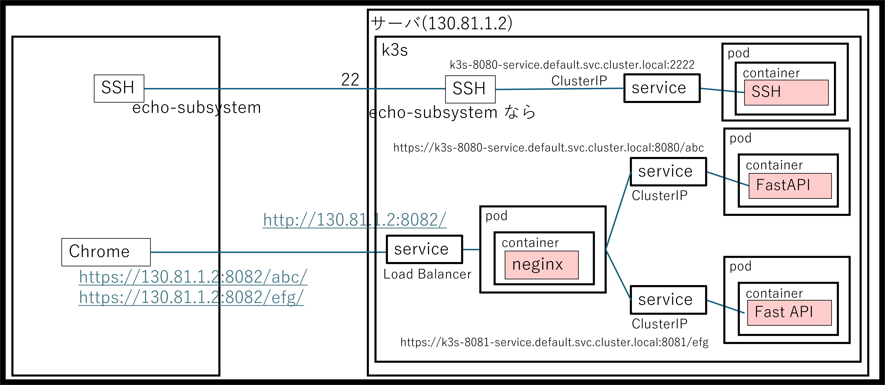

- 今回は以下の3つをDocker化していきます
    - SSH用の [server_fast.py](./ansible/src/server_fast.py)
    - FastAPI用の [server_fast.py](./ansible/src/server_fast.py)
    - nginx によるリバースプロキシ

- 構成としては以下となります
    - ansible
        - group_vars
            - [all.yml](./ansible/group_vars/all.yml)
        - [hosts.yml](./ansible/hosts.yml)
        - [site_k3.yml](./ansible/site_k3s.yml)
        - k3s-8080
            - [Dockerfile](./ansible/k3s-8080/Dockerfile)
            - [server_fast.py](./ansible/k3s-8080/server_fast.py)
        - k3s-8081
            - [Dockerfile](./ansible/k3s-8081/Dockerfile)
            - [server_fast.py](./ansible/k3s-8081/server_fast.py)
        - k3s-8082
            - [Dockerfile](./ansible/k3s-8082/Dockerfile)
            - [reverse_proxy.conf](./ansible/k3s-8082/reverse_proxy.conf)

#### site_k3s.yml (docker build)

- [site_k3.yml](./ansible/site_k3s.yml) の中で docker の buildをしています
- 具体手的には以下の個所です

```yml
    - name: ローカルのフォルダをリモートにコピー
      copy:
        src: "{{ item.service_name }}"
        dest: .
        mode: '0755'
      loop: "{{loop_data}}"
    - name: Dockerfileからイメージをビルド
      community.docker.docker_image:
        name: "{{ item.service_name }}:v1.0" # 作成するイメージ名
        build:
          path: "{{ item.service_name }}" # Dockerfileがあるディレクトリ
        archive_path: "./{{ item.service_name }}/{{ item.archive_path }}"
        source: build
      loop: "{{loop_data}}"
      become: yes
```

- これを k3s 用に image をpushしているのが以下です

```yml
    - name: K3sにイメージをインポート
      ansible.builtin.command:
        cmd: "k3s ctr images import ./{{ item.service_name }}/{{ item.archive_path }}"
      register: import_result
      changed_when: "'importing' in import_result.stdout"
      loop: "{{loop_data}}"
      become: True
```

- やっていることはどれも同じですが nginx に関しては HTTPS で証明書が必要なので
　以下で一端作業用フォルダに鍵を移動させてから Dockerfile の中で container に含める処理を
  しています
- 証明書の管理としては他の方法もありますが、これが一番楽なのでこうしています。
- 他のやり方は本格的に k3s を触るときに確認してください

```yml
    - name: ディレクトリを作成する
      ansible.builtin.file:
        path: ./k3s-8082/ssh
        state: directory
    - name: リモートサーバー内でファイルをコピーする
      ansible.builtin.copy:
        src: /etc/ssl/certs/server.crt
        dest: ./k3s-8082/ssh/server.crt
        remote_src: yes
      become: yes
    - name: リモートサーバー内でファイルをコピーする
      ansible.builtin.copy:
        src: /etc/ssl/private/server.key
        dest: ./k3s-8082/ssh/server.key
        remote_src: yes
      become: yes
```

#### k3s-8080/Dockerfile または k3s-8081/Dockerfile

- [Dockerfile](./ansible/k3s-8080/Dockerfile) は FastAPIを利用した pythonコードを container 化するための Dockerfile です
- pip で fastapi と uvicorn をしているのが特徴です

```Dockefile
FROM python:3.13-slim

# 環境変数の設定 (Pythonのpycファイルを作成しない、ログをバッファリングしない)
ENV PYTHONDONTWRITEBYTECODE=1
ENV PYTHONUNBUFFERED=1

# 作業ディレクトリの設定
WORKDIR /app

# ライブラリのインストール
RUN pip install fastapi uvicorn

# アプリケーションのコードをコピー
COPY server_fast.py .

# 実行コマンド
CMD ["python", "server_fast.py", "8080", "abc"]
```

#### k3s-8082/Dockerfile

- [Dockerfile](./ansible/k3s-8082/Dockerfile) は nginx を container 化するための  Dockerfile です
- 認証ファイルの指定等は後述します

```Dockefile
FROM nginx:latest

# 環境変数の設定 (Pythonのpycファイルを作成しない、ログをバッファリングしない)
ENV PYTHONDONTWRITEBYTECODE=1
ENV PYTHONUNBUFFERED=1

RUN rm -rf /etc/nginx/sites-enabled/default
RUN rm -rf /etc/nginx/sites-available/default
RUN mkdir -p /etc/ssl/certs
COPY ./ssh/server.crt /etc/ssl/certs
RUN mkdir -p /etc/ssl/private
COPY ./ssh/server.key /etc/ssl/private

# 作業ディレクトリの設定
WORKDIR /etc/nginx/conf.d
COPY reverse_proxy.conf .

# 起動ポートの指定
EXPOSE 8082
```

#### k3s-8082/reverse_proxy.conf

- [reverse_proxy.conf](./ansible/k3s-8082/reverse_proxy.conf) は nginx 用の設定ファイルです。後述します

```text
server {
    listen 8082 ssl;
    server_name k3s-8082-service.default.svc.cluster.local;
    # 証明書と秘密鍵のパスを指定
    ssl_certificate     /etc/ssl/certs/server.crt;
    ssl_certificate_key /etc/ssl/private/server.key;
    location /abc {
        proxy_pass http://k3s-8080-service.default.svc.cluster.local:8080/abc;
        proxy_set_header Host $host;
        proxy_set_header X-Real-IP $remote_addr;
    }
    location /efg {
        proxy_pass http://k3s-8081-service.default.svc.cluster.local:8081/efg;
        proxy_set_header Host $host;
        proxy_set_header X-Real-IP $remote_addr;
    }
}
```

### pod の適用

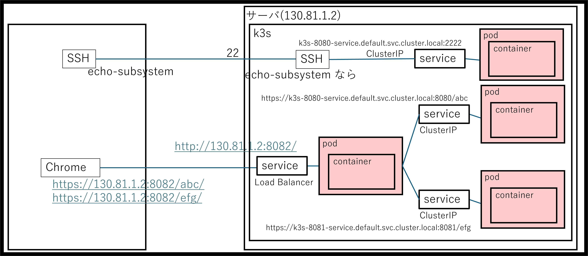

- container ができたのでそれを pod としてデプロイしていきます
- k3s（Kubernetes）のPod（ポッド）とは、クラスターの中で動く「container を包む最小の単位」です。

#### site_k3s.yml (podの適用)

- [site_k3.yml](./ansible/site_k3s.yml) の中で pod のデプロイをしています
- 具体手的には以下の個所です
    - まず `k3s ctr images import` で docker で作った contanier を k3s にインポートします
    - インポートしたものを kubectl apply でデプロイしています

```yaml
    - name: K3sにイメージをインポート
      ansible.builtin.command:
        cmd: "k3s ctr images import ./{{ item.service_name }}/{{ item.archive_path }}"
      register: import_result
      changed_when: "'importing' in import_result.stdout"
      loop: "{{loop_data}}"
      become: True
    - name: k3sにデプロイ(pod)
      ansible.builtin.command:
        cmd: "kubectl apply -f  ./{{ item.service_name }}/deployment.yaml"
      register: apply_register
      loop: "{{loop_data}}"
      become: True
    - debug:
        var: apply_register
```

- デプロイには `deployment.yaml` を使いました
- 具体手的には以下の個所です

```yml
apiVersion: apps/v1
kind: Deployment
metadata:
  name: k3s-8082-app
spec:
  replicas: 1
  selector:
    matchLabels:
      app: k3s-8082-app
  template:
    metadata:
      labels:
        app: k3s-8082-app
    spec:
      containers:
      - name: k3s-8082-app
        image: docker.io/library/k3s-8082:v1.0 # sudo k3s ctr images listで得たREF
        imagePullPolicy: Never
        ports:
        - containerPort: 8082  # ここでポート番号を指定
          name: https          # ポートに名前を付けると後で便利（任意）
          protocol: TCP        # デフォルトはTCP

```

- image は `sudo k3s ctr images list` で得た値を使います

```shell
$ sudo k3s ctr -n k8s.io images list -q | grep library
docker.io/library/k3s-2222:v1.0
docker.io/library/k3s-8080:v1.0
docker.io/library/k3s-8081:v1.0
docker.io/library/k3s-8082:v1.0
docker.io/rancher/mirrored-library-traefik:2.11.24
docker.io/rancher/mirrored-library-traefik@sha256:d9b1433d05834551d2814d4e7f7eeaa6fe8d4143f1bf67dd9c13d12a42447350
```

- 以下のコマンドで動作が動いているか失敗しているかが分かります
- ここが最初のハードルです。STATUS が 'Running' でない場合、正常動作していません

```shell
$ sudo kubectl get pods
NAME                            READY   STATUS    RESTARTS   AGE
k3s-2222-app-5cfbf6977-xnlmq    1/1     Running   0          3h20m
k3s-8080-app-6f849c9dd9-k2zbx   1/1     Running   0          9h
k3s-8081-app-8566d68487-rx9bl   1/1     Running   0          7h37m
k3s-8082-app-54845665b8-8qrdz   1/1     Running   0          3h20m
```

- その場合は以下のコマンドで、失敗原因を探ることになります

```shell
$ sudo kubectl logs  k3s-8082-app-54845665b8-8qrdz  | head
/docker-entrypoint.sh: /docker-entrypoint.d/ is not empty, will attempt to perform configuration
/docker-entrypoint.sh: Looking for shell scripts in /docker-entrypoint.d/
/docker-entrypoint.sh: Launching /docker-entrypoint.d/10-listen-on-ipv6-by-default.sh
10-listen-on-ipv6-by-default.sh: info: Getting the checksum of /etc/nginx/conf.d/default.conf
10-listen-on-ipv6-by-default.sh: info: Enabled listen on IPv6 in /etc/nginx/conf.d/default.conf
/docker-entrypoint.sh: Sourcing /docker-entrypoint.d/15-local-resolvers.envsh
/docker-entrypoint.sh: Launching /docker-entrypoint.d/20-envsubst-on-templates.sh
/docker-entrypoint.sh: Launching /docker-entrypoint.d/30-tune-worker-processes.sh
/docker-entrypoint.sh: Configuration complete; ready for start up
2026/05/01 03:50:24 [notice] 1#1: using the "epoll" event method
```

- また、以下のコマンドで pods の IPアドレスを知ることができます

```shell
$ sudo kubectl get pods -o wide
NAME                            READY   STATUS    RESTARTS   AGE     IP           NODE    NOMINATED NODE   READINESS GATES
k3s-2222-app-5cfbf6977-xnlmq    1/1     Running   0          3h19m   10.42.0.35   tando   <none>           <none>
k3s-8080-app-6f849c9dd9-k2zbx   1/1     Running   0          9h      10.42.0.23   tando   <none>           <none>
k3s-8081-app-8566d68487-rx9bl   1/1     Running   0          7h36m   10.42.0.24   tando   <none>           <none>
k3s-8082-app-54845665b8-8qrdz   1/1     Running   0          3h19m   10.42.0.36   tando   <none>           <none>
```

- この IPにより、正常に動いているかを確認することができます
- 例えば k3s-8080-app-6f849c9dd9-k2zbx を確認する場合 IP が 10.42.0.23 なので、以下のように確認ができます

```shell
$ curl http://10.42.0.23:8080/abc
"Hello World (abc)"
```

### coreDNS にノードからアクセスできるようにする

- これまでは pod を作成しましたが、内部または外部から pod にアクセスするためにはIPを直接は使えません
- なぜなら k3s は複数のサーバのどこかにIPが置かれるという性質上、IPが可変であるためです
- このため サービス名からホスト名を作る機構が k3s には coreDNS という名称であります
- k3sのCoreDNSとは、クラスター内部で動いている「電話帳（DNSサーバー）」のような役割を持つコンポーネントです。

#### site_k3s.yml (coreDNS)

- [site_k3.yml](./ansible/site_k3s.yml) の中で Nodeから知るために DNS アクセス用の設定を変えています
- 具体手的には以下の個所です
    - 最初に `/etc/systemd/resolved.conf.d` フォルダを作成して、
      `/etc/systemd/resolved.conf.d/k3s-dns.conf` を作ろうとしたときに
      エラーが出ないようにしています
    - 次に `kubectl get svc kube-dns` ... のコマンドを投入して、
      coreDNSのIPアドレスを `coredns_ip.stdout` に収集します
    - `/etc/systemd/resolved.conf.d/k3s-dns.conf` に
      `svc.cluster.local` か `cluster.local` がアドレス末尾にあるときに
      coreDNSにつなぐ設定を行っています
    - `notify` で変更があった場合のみ `systemd-resolved` の再立ち上げを行います

```yml
    - name: systemd-resolvedの設定ディレクトリを作成
      file:
        path: /etc/systemd/resolved.conf.d
        state: directory
        mode: '0755'
      become: True

    - name: k3sのCoreDNS Service IPを得る
      shell: "kubectl get svc kube-dns -n kube-system -o jsonpath='{.spec.clusterIP}'"
      register: coredns_ip
      changed_when: false
      become: True
    - debug:
        var: coredns_ip

    - name: k3s専用のDNS振り分け設定を配置
      copy:
        dest: /etc/systemd/resolved.conf.d/k3s-dns.conf
        content: |
          [Resolve]
          DNS={{ coredns_ip.stdout }}
          Domains=~svc.cluster.local ~cluster.local
        mode: '0644'
      become: True
      notify: Restart systemd-resolved


  handlers:
    - name: Restart systemd-resolved
      systemd:
        name: systemd-resolved
        state: restarted
      become: True
```

### service の適用

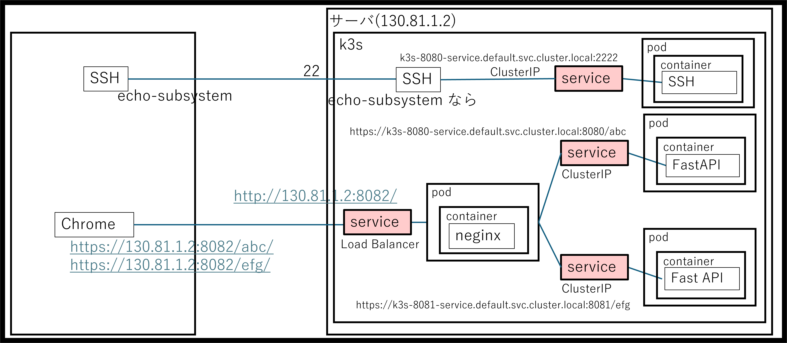

- coreDNS でアドレスが取れるのは service のIPアドレスです
- k3sのService（サービス）とは、一言でいうと「Podにアクセスするための、変わらない窓口（固定IPと名前）」のことです。
- そのためサービスは内部用の IP や、外部に接続できる port を有します

#### site_k3s.yml (service)

- [site_k3.yml](./ansible/site_k3s.yml) の中で service のデプロイをしています
- 具体手的には以下の個所です
    - まず `k3s ctr images import` で docker で作った contanier を k3s にインポートします
    - インポートしたものを kubectl apply でデプロイしています

```yml
    - name: k3sにデプロイ(service)
      ansible.builtin.command:
        cmd: "kubectl apply -f  ./{{ item.service_name }}/service.yaml"
      register: apply_register
      loop: "{{loop_data}}"
      become: True
    - debug:
        var: apply_register
```

- ここで service.yaml や具体的にサービスとして何を提供するかを記載します
- 例えば [k3s-8080/service.yaml](./ansible/k3s-8080/service.yaml)
  の例ではクラスタ内部用にサービスを提供しています
    - `type` が `ClusterIP` であり、外部に 8081 ポートを提供しています

```yaml
apiVersion: v1
kind: Service
metadata:
  name: k3s-8081-service  # サービス名
spec:
  selector:
    app: k3s-8081-app    # 連携するPodのラベルを指定
  ports:
    - protocol: TCP
      port: 8081       # サービスが受け付けるポート
      targetPort: 8081 # Pod側で動いているアプリのポート
  type: ClusterIP      # クラスター内部用（外部公開ならNodePort等）
```

- 例えば [k3s-8082/service.yaml](./ansible/k3s-8082/service.yaml)
  の例ではクラスタ内部用にサービスを提供しています
    - `type` が `LoadBalancer` であり、外部に 8082 ポートを提供しています

```yaml
apiVersion: v1
kind: Service
metadata:
  name: k3s-8082-service  # サービス名
spec:
  type: LoadBalancer     # ロードバランサ
  selector:
    app: k3s-8082-app    # 連携するPodのラベルを指定
  ports:
    - protocol: TCP
      port: 8082         # 外部公開ポート
      targetPort: 8082   # Pod側で動いているアプリのポート
```

- service が動いてるかを確認するのは以下のコマンドです

```shell
$ sudo kubectl get svc
[sudo] password for t-ando:
NAME               TYPE           CLUSTER-IP      EXTERNAL-IP      PORT(S)          AGE
k3s-2222-service   ClusterIP      10.43.211.115   <none>           2222/TCP         8h
k3s-8080-service   ClusterIP      10.43.157.137   <none>           8080/TCP         9h
k3s-8081-service   ClusterIP      10.43.170.85    <none>           8081/TCP         8h
k3s-8082-service   LoadBalancer   10.43.91.52     192.168.40.195   8082:32409/TCP   5h32m
kubernetes         ClusterIP      10.43.0.1       <none>           443/TCP          23h
```

- coreDNS によって 上記 IP にサービス名が振り分けられているのが nslookupで確認できます
- `サービス名.ネームスペース.svc.cluster.local` でアクセスできるようになります
    - ネームスペースのデフォルトは `default` です

```shell
$ nslookup k3s-2222-service.default.svc.cluster.local
Server:         127.0.0.53
Address:        127.0.0.53#53

Non-authoritative answer:
Name:   k3s-2222-service.default.svc.cluster.local
Address: 10.43.211.115
```

- これによりサービス名をホスト名にして それぞれの service にアクセスできることが確認できます

```shell
$ curl http://k3s-8080-service.default.svc.cluster.local:8080/abc
"Hello World (abc)"

$ curl http://k3s-8081-service.default.svc.cluster.local:8081/efg
"Hello World (efg)"

$ telnet k3s-2222-service.default.svc.cluster.local 2222
Trying 10.43.211.115...
Connected to k3s-2222-service.default.svc.cluster.local.
Escape character is '^]'.
aaa
Echo: aaa

Connection closed by foreign host.
```

- [k3s-8082/service.yaml](./ansible/k3s-8082/service.yaml) により
  外部公開された 8082 は外部からもアクセスができます

- `https://130.81.1.2:8082/abs` を k3s-8082 のサービスが受けると
    同 pod に転送されて、
    pod 内の contaner 、つまり nginx で受けます

    - contaner 内ではリバースプロキシの設定
      [reverse_proxy.conf](./ansible/k3s-8082/reverse_proxy.conf) として
      以下の設定が入っています。
    - そのため以下の動作となります
        - /abc を受けた場合には `http://k3s-8080-service.default.svc.cluster.local:8080/abc` へ転送
        - /efg を受けた場合には `http://k3s-8081-service.default.svc.cluster.local:8081/efg` へ転送
    - また認証鍵の設定をここでは container 内に収めて行っていますが、
       この辺りは他の方法もあります

```text
server {
    listen 8082 ssl;
    server_name k3s-8082-service.default.svc.cluster.local;
    # 証明書と秘密鍵のパスを指定
    ssl_certificate     /etc/ssl/certs/server.crt;
    ssl_certificate_key /etc/ssl/private/server.key;
    location /abc {
        proxy_pass http://k3s-8080-service.default.svc.cluster.local:8080/abc;
        proxy_set_header Host $host;
        proxy_set_header X-Real-IP $remote_addr;
    }
    location /efg {
        proxy_pass http://k3s-8081-service.default.svc.cluster.local:8081/efg;
        proxy_set_header Host $host;
        proxy_set_header X-Real-IP $remote_addr;
    }
}
```

- 内部で動作確認をする場合、以下のような結果がでればOKです
    - なお、オレオレ証明書ですので -k オプションがないとエラーになります

```shell
$ curl -k https://k3s-8082-service.default.svc.cluster.local:8082/abc
"Hello World (abc)"

$ curl -k https://k3s-8082-service.default.svc.cluster.local:8082/efg
"Hello World (efg)"
```

- 外部から動作確認する場合、以下のような結果がでればOKです


### SSHをSubsystemで振り分けて k3s の service に渡す

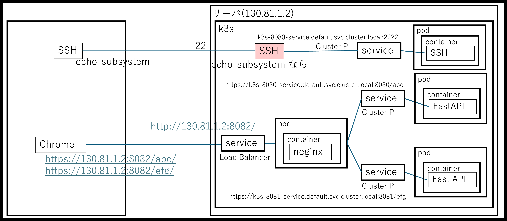

- ホスト名から service の IP を引けるようになったので
  特定の SSH のSubsystemが来た場合に、
  service に転送する処理を実装します

#### site_k3s.yml (subsystem)

- [site_k3.yml](./ansible/site_k3s.yml) の中で 転送処理をしています
- 具体手的には以下の個所です
    - `/etc/ssh/sshd_config` で subsystem が echo-subsystem のとき
      アドレス k3s-2222-service.default.svc.cluster.local の
      ポート 2222 へ飛ばす処理をしています
    - これにより service にデータが流されて処理が行われます

```yml
    - name: Ensure subsystem is configured
      lineinfile:
        path: /etc/ssh/sshd_config
        regexp: '^Subsystem\s+echo-subsystem'
        line: 'Subsystem echo-subsystem /usr/bin/nc k3s-2222-service.default.svc.cluster.local 2222'
        state: present
      notify: Restart sshd
      become: True
```

- これから [client_sub.py](./ansible/src/client_sub.py) から呼べることを確認します

```yml
$ python3 ./src/client_sub.py 130.81.1.2 22
Sent: Hello, Paramiko!

Received: Echo: Hello, Paramiko!
```

## まとめ

- いかがでしたでしょうか。
- SSHで多数使っているポート番号の一本化、および、HTTPSの証明書の一本化、ならびに、HTTPSのポートの削減がこれらによりできるようになりました
- これでかなりセキュリティが向上できることでしょう

- Enjoy!
